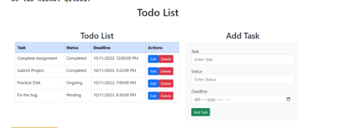

---
created:
  - 21-04-2024 17:34:14
title:
  - 5-dars. HTTP moduli davomi va WebSocket
tags:
  - CourseNote/
---

# Home Work

# Node.js & HTTP Modulidan Foydalanib To-Do Application Yaratish

Ushbu uyga vazifada siz Node.js'ning asosiy http modulidan foydalangan holda oddiy To-Do (vazifalar ro'yxati) ilovasini yaratishingiz kerak. Bu ilova CRUD (Yaratish, O'qish, Yangilash, O'chirish) operatsiyalarini qo'llab-quvvatlaydi.

Vazifa Tavsifi:

Sizning To-Do ilovangiz quyidagi xususiyatlarga ega bo'lishi kerak:

1. CRUD Funktsionali: To-Do ro'yxatiga yangi vazifa qo'shish, mavjud vazifalarni ko'rish, tahrirlash va o'chirish.
	1. cread => POST
	2. read => GET 
	3. update => PUT
	4. delete => DELETE

2. Server Tuzilishi: Node.js va http modulidan foydalanish.
3. Ma'lumotlar Saqlash: Vazifalarni saqlash va boshqarish uchun oddiy JSON faylidan foydalanish..

Vazifani Tekshirish:

- Har bir CRUD operatsiyasini sinab ko'ring va ularning to'g'ri ishlashini tekshiring.
- Postman yoki boshqa HTTP klient dasturi yordamida so'rovlar yuborib, javoblarni tekshiring.

Ushbu uyga vazifa orqali siz Node.js'da HTTP serverlar yaratishni va CRUD operatsiyalarini boshqarishni o'rganasiz, bu bilimlar kelajakda murakkabroq back-end ilovalarni ishlab chiqishda asos bo'lib xizmat qiladi.

# [Postman](https://www.postman.com/) shu programmani o'rnatib kelish.(ustiga bosing link u)