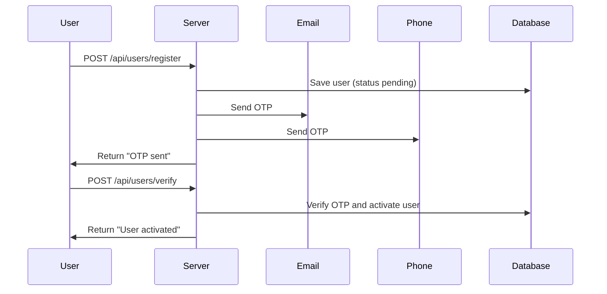
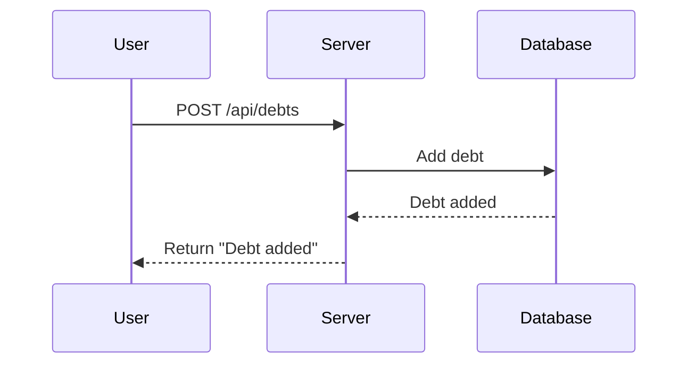
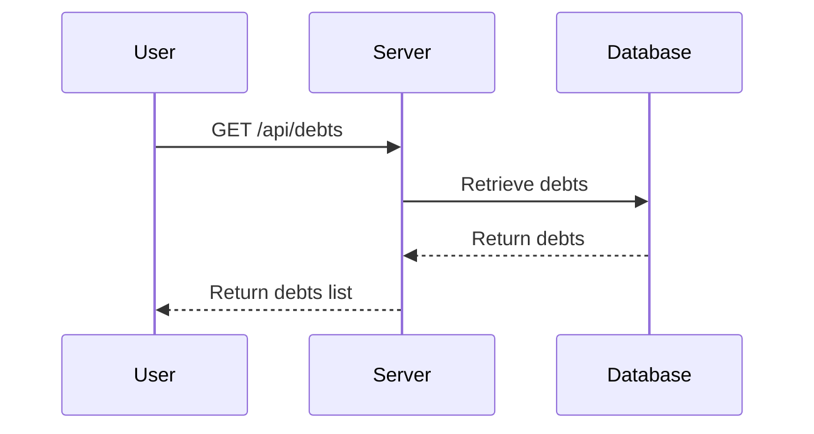
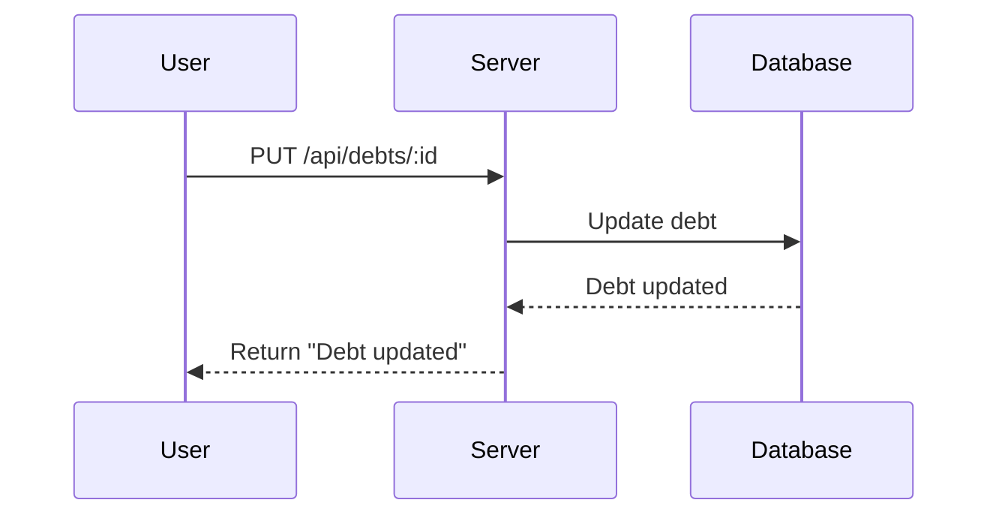
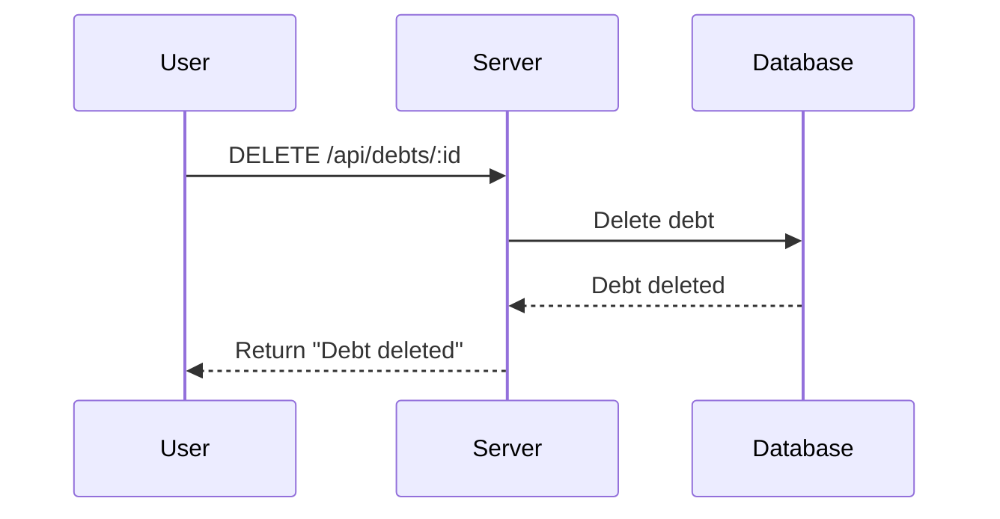

### Qarz Daftari Loyiha: Texnik Zadaniyalar

**Loyihaning Maqsadi:** Foydalanuvchilar o'zlarining qarzlarini boshqarishi mumkin bo'lgan tizim yaratish. Foydalanuvchilar qarzlarini kiritishi, ko'rishi, yangilashi va o'chirishi mumkin. Adminlar barcha foydalanuvchilar va qarzlarni boshqarishi mumkin.

---

#### **1. Foydalanuvchi Ro'yxatdan O'tishi va Tizimga Kirish**

##### **1.1. Ro'yxatdan O'tish (Sign Up)**
- **Endpoint:** `POST /api/users/register`
- **Kiritiladigan Ma'lumotlar:**
  - `username`: (string) Foydalanuvchi nomi, kamida 3 ta belgi
  - `email`: (string) Unikal email manzili
  - `password`: (string) Kamida 6 ta belgi
  - `phone`: (string) Telefon raqami
- **Amallar:**
  - Foydalanuvchi ma'lumotlarini saqlash (`status` `pending` bo'ladi).
  - Email va telefon raqamiga OTP yuborish.
- **Javob:**
  - `201 Created` - "Foydalanuvchi yaratildi va OTP yuborildi."
  - `400 Bad Request` - "Email yoki foydalanuvchi nomi allaqachon mavjud yoki noto'g'ri ma'lumot."

##### **1.2. OTP-ni Tasdiqlash (Verify OTP)**
- **Endpoint:**
  - **API orqali:** `POST /api/users/verify`
  - **Telegram bot orqali:** `/verify` boti va "Share Contact" tugmasi orqali.
- **Kiritiladigan Ma'lumotlar:**
  - **API orqali:** 
    - `email_or_phone`: (string) Ro'yxatdan o'tishda kiritilgan email yoki telefon raqam
    - `otp`: (string) Email yoki telefon orqali yuborilgan OTP
  - **Telegram bot orqali:**
    - Foydalanuvchi "Start" tugmasini bosadi va bot orqali telefon raqamini ulashadi.
    - Bot foydalanuvchining telefon raqamini API orqali tekshiradi.
- **Amallar:**
  - **API orqali:** OTP ni tekshirish, foydalanuvchi `status`ini `active` ga o'zgartirish.
  - **Telegram bot orqali:** Foydalanuvchi telefon raqamini tekshirish va tasdiqlash, foydalanuvchi `status`ini `active` ga o'zgartirish.
- **Javob:**
  - **API orqali:**
    - `200 OK` - "Tasdiqlash muvaffaqiyatli va foydalanuvchi aktivlashtirildi."
    - `400 Bad Request` - "Noto'g'ri OTP yoki email/telefon raqam."
  - **Telegram bot orqali:**
    - Bot orqali foydalanuvchiga "Tasdiqlash muvaffaqiyatli" yoki "Noto'g'ri telefon raqam" xabari yuboriladi.

##### **1.3. Tizimga Kirish (Login)**
- **Endpoint:** `POST /api/users/login`
- **Kiritiladigan Ma'lumotlar:**
  - `username`: (string) Foydalanuvchi nomi
  - `password`: (string) Parol
- **Amallar:**
  - Foydalanuvchini ma'lumotlar bazasidan topish va parolni tekshirish.
  - JWT token yaratish.
- **Javob:**
  - `200 OK` - "Muvaffaqiyatli tizimga kirildi." (token bilan birga)
  - `401 Unauthorized` - "Noto'g'ri foydalanuvchi nomi yoki parol."

---

#### **2. Qarzlar Boshqaruvi**

##### **2.1. Yangi Qarz Qo'shish**
- **Endpoint:** `POST /api/debts`
- **Kiritiladigan Ma'lumotlar:**
  - `amount`: (decimal) Qarz miqdori
  - `description`: (string) Qarz tavsifi
  - `due_date`: (date) Qarzning qaytarilish sanasi
  - `status`: (string) Qarz holati (`new`, `paid`, `canceled`)
- **Amallar:**
  - Qarzni ma'lumotlar bazasiga qo'shish.
- **Javob:**
  - `201 Created` - "Yangi qarz qo'shildi."
  - `400 Bad Request` - "Noto'g'ri ma'lumot."

##### **2.2. Qarzlar Ro'yxatini Ko'rish**
- **Endpoint:** `GET /api/debts`
- **Optional Parametrlar:**
  - `status`: (string) Qarzning holati bo'yicha filtr
- **Amallar:**
  - Foydalanuvchining qarzlarini ma'lumotlar bazasidan olish.
- **Javob:**
  - `200 OK` - "Foydalanuvchining qarzlari ro'yxati."
  - `401 Unauthorized` - "Token yo'q yoki noto'g'ri."

##### **2.3. Qarzni Yangilash**
- **Endpoint:** `PUT /api/debts/:id`
- **Kiritiladigan Ma'lumotlar:**
  - `amount`: (decimal) Yangi qarz miqdori
  - `description`: (string) Yangi qarz tavsifi
  - `due_date`: (date) Yangi qaytarilish sanasi
  - `status`: (string) Yangi qarz holati (`new`, `paid`, `canceled`)
- **Amallar:**
  - Qarzni ma'lumotlar bazasida yangilash.
- **Javob:**
  - `200 OK` - "Qarz yangilandi."
  - `400 Bad Request` - "Noto'g'ri ma'lumot."
  - `404 Not Found` - "Qarz topilmadi."

##### **2.4. Qarzni O'chirish**
- **Endpoint:** `DELETE /api/debts/:id`
- **Amallar:**
  - Qarzni ma'lumotlar bazasidan o'chirish.
- **Javob:**
  - `200 OK` - "Qarz o'chirildi."
  - `404 Not Found` - "Qarz topilmadi."

---

#### **3. Admin Boshqaruvi**

##### **3.1. Foydalanuvchilar Ro'yxatini Ko'rish**
- **Endpoint:** `GET /api/admin/users`
- **Amallar:**
  - Foydalanuvchilar ro'yxatini olish.
- **Javob:**
  - `200 OK` - "Foydalanuvchilar ro'yxati."
  - `403 Forbidden` - "Admin ruxsat yo'q."

##### **3.2. Foydalanuvchini Yangilash**
- **Endpoint:** `PUT /api/admin/users/:id`
- **Kiritiladigan Ma'lumotlar:**
  - `username`: (string) Yangi foydalanuvchi nomi
  - `email`: (string) Yangi email
  - `role`: (string) Yangi rol (`user`, `admin`)
- **Amallar:**
  - Foydalanuvchini yangilash.
- **Javob:**
  - `200 OK` - "Foydalanuvchi yangilandi."
  - `400 Bad Request` - "Noto'g'ri ma'lumot."
  - `403 Forbidden` - "Admin ruxsat yo'q."

##### **3.3. Foydalanuvchini O'chirish**
- **Endpoint:** `DELETE /api/admin/users/:id`
- **Amallar:**
  - Foydalanuvchini o'chirish.
- **Javob:**
  - `200 OK` - "Foydalanuvchi o'chirildi."
  - `403 Forbidden` - "Admin ruxsat yo'q."

---

### **Ma'lumotlar va Flow Diagrammalari**

#### **1. Ro'yxatdan O'tish Flow:**

1. Foydalanuvchi ro'yxatdan o'tish formasini to'ldiradi.
2. Ma'lumotlar `POST /api/users/register` orqali yuboriladi.
3. Server foydalanuvchini saqlaydi va OTP yuboradi.
4. Foydalanuvchi email yoki telefon orqali yuborilgan OTP ni tasdiqlash uchun forma to'ldiradi.
5. Ma'lumotlar `POST /api/users/verify` orqali yuboriladi.
6. Server OTP ni tasdiqlaydi va foydalanuvchi statusini "active" qiladi.

#### **2. Qarz Qo'shish Flow:**

1. Foydalanuvchi yangi qarz ma'lumotlarini kiradi.
2. Ma'lumotlar `POST /api/debts` orqali yuboriladi.
3. Server yangi qarzni ma'lumotlar bazasiga saqlaydi va foydalanuvchiga muvaffaqiyat xabari qaytaradi.

#### **3. Qarzlar Ro'yxatini Ko'rish Flow:**

1. Foydalanuvchi qarzlar ro'yxatini ko'rish uchun so'rov yuboradi.
2. So'rov `GET /api/debts` orqali amalga oshiriladi.
3. Server foydalanuvchining qarzlarini qaytaradi.

#### **4. Qarzni Yangilash Flow:**

1. Foydalanuvchi qarzni yangilash ma'lumotlarini kiritadi.
2. Ma'lumotlar `PUT /api/debts/:id` orqali yuboriladi.
3. Server qarzni yangilaydi va foydalanuvchiga tasdiq qaytaradi.

#### **5. Qarzni O'chirish Flow:**

1. Foydalanuvchi qarzni o'chirish uchun so'rov yuboradi.
2. So'rov `DELETE /api/debts/:id

` orqali amalga oshiriladi.
3. Server qarzni o'chiradi va foydalanuvchiga tasdiq qaytaradi.

---

### **Hujjatlar Yaratish Bo'yicha Qadamlar**

**1. RBAC (Role-Based Access Control) Tartibini Belgilash:**
   - Har bir rol uchun ruxsatlar ro'yxatini hujjatlashtirish.
   - Foydalanuvchi va admin rollarining imkoniyatlarini belgilash.

---

### **Diagrammalar**

**Ro'yxatdan O'tish Diagrammasi:**

**Qarz Qo'shish Diagrammasi:**

**Qarzlar Ro'yxatini Ko'rish Diagrammasi:**

**Qarzni Yangilash Diagrammasi:**

**Qarzni O'chirish Diagrammasi:**

### **RBAC (Role-Based Access Control)**

- **Foydalanuvchi**:
  - **Qarzlar:**
    - Yangi qarz qo'shish
    - O'z qarzlarini ko'rish
    - O'z qarzlarini yangilash
    - O'z qarzlarini o'chirish

- **Admin**:
  - **Foydalanuvchilar:**
    - Foydalanuvchilar ro'yxatini ko'rish
    - Foydalanuvchilarni yangilash
    - Foydalanuvchilarni o'chirish
  - **Qarzlar:**
    - Barcha foydalanuvchilar qarzlarini ko'rish
    - Barcha foydalanuvchilar qarzlarini yangilash
    - Barcha foydalanuvchilar qarzlarini o'chirish

Bu texnik zadaniyalar yordamida foydalanuvchilar va adminlar qarzlarni samarali boshqarishlari va tizimni muvaffaqiyatli yuritishlari mumkin. Har bir qadamda ma'lumot kiritish va javob olish jarayonlari aniq belgilangan bo'lib, tizimni optimal tarzda qurishga yordam beradi.